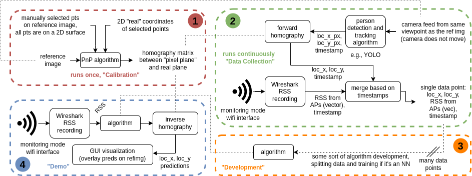

# WiFi based Indoor Self-Positioning Experiments

Benchmarking and developing no-reference RSS-based indoor positioning systems (i.e., input = only RSS, output = location predictions). We use a calibrated camera-based setup to collect ground truth location information and simultaneously sample input RSS data points over wireshark for training and evaluation. Demos do not require any live input from the camera (only the reference image is used for visualization). 

--- 
## Description

An experiment requires 2 computers (not necessarily 2 people): a "Location Logger" (cLL) and an "RSS logger" (cRS). 4 stages are considered in an experiment:

**1- Calibration:** Use "calibration.py" to set up a fixed camera on cLL, get a reference image + a homography matrix over known calibration points in that image (manual / ArUco). cRS is not involved in this step. The camera should not move after this step to keep the homography matrix applicable throughout the experiment.

**2- Data Collection:** Needs to run simultaneously on cLL and cRS ("datacollection_loc.py" and "datacollection_rss.py"), synced with timestamps (clock sync over NTP before running). cRS is carried by a person who moves around and runs tshark to log RSS values. cLL is stationary, and runs a person tracking model (w.r.t. ground w/ homography) to get {loc_x, loc_y, RSS values}. Results for loc and rss get merged after the exp using "datacollection_merge.py".

**3- Development:** Training and evaluating neural net based algorithms, dictionary selection for non parametric algorithms (e.g., nearest neighbour (NeNe), NeNe+interp etc.). The code used in this stage is custom, we save it into the experiment folder.

**4- Demo:** Runs on the cRS with a real-time data stream. A GUI shows realtime updates overlaid on the reference image taken during the calibration step.

Each experiment has a "data package" associated with it. The data package contains:

- **"devstring.txt"**: the devstring of the camera used during the calibration stage
- **"reference_image.png"**: a reference image from the camera
- **"reference_image_withHomographyAnchors.png"**: a version of the reference_image showing the anchors used for obtaining the homography matrix
- **"homography_matrix.npy/txt"**: the homography matrix, saved as both a loadable file as well as a human-readable file
- **"wifi_chconfig.sh"**: runnable wifi channel config script (hardcode any arguments in the script such that "bash wifi_chconfig.sh" works). This can simply select 1 channel, or hop between channels (modified version the utils/wifi_channel_hopping/chanhop_original.sh  
- **"tshark.txt"**: raw tshark log for the experiment (collected by cRS, containing RSS data)
- **"loc_xy.txt"**: raw loc_x/loc_y log for the experiment (collected by CLL, containing ground truth location data)
- **"data.json"**: merged RSS + camera-based loc_x/loc_y data, no new data on top of tshark.txt + loc_xy.txt

Different algorithms can be developed for and demonstrated on that data package.

---

## Installation and Usage

#### For Development
...

#### For Demonstrations
...

