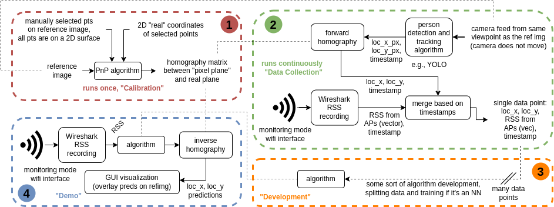

# WiFi based Indoor Self-Positioning Experiments

Benchmarking and developing no-reference RSS-based indoor positioning systems (i.e., input = only RSS, output = location predictions). We use a calibrated camera-based setup to collect ground truth location information and simultaneously sample input RSS data points over wireshark for training and evaluation. Demos do not require any live input from the camera (only the reference image is used for visualization). 

--- 
## Description

An "experiment" requires 2 computers (not necessarily 2 people): a Location Logger (cLL) and an RSS logger (cRS). 2 stages are considered in an experiment:

**Calibration:** Use "calibration.py" to set up a fixed camera on cLL, get a reference image + a homography matrix over known calibration points in that image (manual / ArUco). cRS is not involved in this step. The camera should not move after this step to keep the homography matrix applicable throughout the experiment.

**Data Collection:** Needs to run simultaneously on cLL and cRS ("datacollection_loc.py" and "datacollection_rss.py"), synced with timestamps (clock sync over NTP before running). cRS is carried by a person who moves around and runs tshark to log RSS values. This person will wear printed versions of a certain aruco tag to be identified from within a crowd. cLL is stationary, and runs a person tracking model (w.r.t. ground w/ homography) to get {loc_x, loc_y} values. Results for loc and RSS get merged after the exp using "datacollection_merge.py" to get labeled tuples of {loc_x, loc_y, RSS}. We don't filter out any WiFi message at the collection phase, algorithms decide which data points to use.

Each experiment has a "data package" associated with it. The data package contains:

- **"devstring.txt"**: the devstring of the camera used during the calibration stage + realized cam width and height (not desired, realized) 
- **"reference_image.png"**: reference image from the stationary camera
- **"reference_image_withHomographyAnchors.png"**: a version of the reference_image showing the anchors used for obtaining the homography matrix
- **"homography_matrix.npy/txt"**: the homography matrix, saved as both a loadable file as well as a human-readable file
- **"wifi_chconfig.sh"**: runnable wifi channel config script (hardcode any arguments in the script such that "bash wifi_chconfig.sh" works). This can simply select 1 channel, or hop between channels (modified version the utils/wifi_channel_hopping/chanhop_original.sh  
- **"tshark.txt"**: raw tshark log for the experiment (collected by cRS, containing RSS data)
- **"loc_xy.txt"**: raw loc_x/loc_y log for the experiment (collected by CLL, containing ground truth location data)
- **"data.json"**: merged RSS + camera-based loc_x/loc_y data, no new data on top of tshark.txt + loc_xy.txt

**Development:** Once an experiment is done, an algorithm can be developed based on that data (stage 3). This pertains to training and evaluating neural net based algorithms, dictionary selection for non parametric algorithms (e.g., nearest neighbour (NeNe), NeNe+interp etc.) etc. The code used in this stage is custom, we save it into the development folder. The sub-components reside in py files and tests with result graphs etc. reside on jupyter notebooks. This development folder has no live test mechanism, basically only datasets generated in the experiments/ folder can be used.

**Demo:** For developed algorithms that are ready for a live demo, we have the demo.py file at the top level. That basically runs on the cRS with a real-time data stream, predicting position based on RSS values (stage 4). The GUI shows realtime updates overlaid on the reference image taken during the calibration step.

This 4-stage system is depicted below:

---

## Installation and Usage

note: had to do this to make calibration_gui.py and datacollection_loc.py work at the same time (deleted cv's libqxcb.so) --> https://forum.qt.io/topic/119109/using-pyqt5-with-opencv-python-cv2-causes-error-could-not-load-qt-platform-plugin-xcb-even-though-it-was-found/2

#### For Development
...

#### For Demonstrations
...

