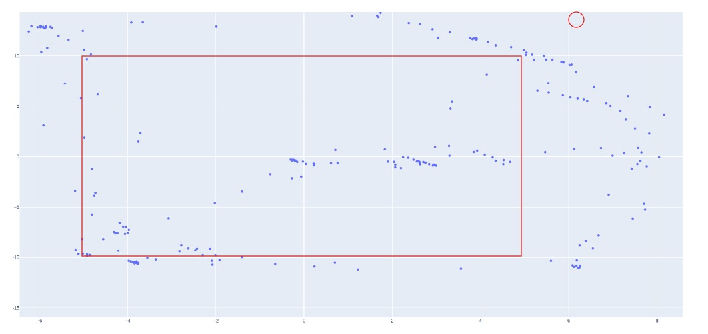

İlk olarak https://github.com/zhengthomastang/Cal_PnP bu repoyu çalıştırmak ve nasıl çalıştığını anlamamız gerekiyor. Bu repodaki kodu biraz değiştirdim ve kendi yazdığım kod ile birleştirdim.

https://github.com/zhengthomastang/Cal_PnP bu repoda bulunan, nokta secme islemini bu adamin yaptigi şekilde kullanarak pixel seçme işlemini yazpıyoruz, devaminda cv.py dosyası içinde opencv2 kütüphanesini kullanarak homography matrix bulup world coordinate çeviriyoruz. Githubdaki methodu kullanarak homography matrix bulduğumuz zaman sonuç yanlis geliyordu o yuzden onu kullanamadık sadece pıxel pointleri secme işlemi için kullandık. kendi bilgisayarimda calisacak sekilde yaptim o yuzden direkt çalıştırmak istersek pathlerde biraz sorun cikabilir.

------------------------------------------

bizim salondaki hali uzerinde test ettim 2 farkli yere koydum kamerayi ikisinde de benzer sonuc verdi, (resimdeki ornekte kamera 7,15 noktasina yakın bir yerde, kırmızı çember kamera, kırmızı dikdörtgen de halı) salon biraz kucuk oldugu icin kameraya yakin oldugum yerlerde sonuc yanlis gozukuyor ama kamerdan uzak bir yere gecince ve halinin ortasinda bekleyince sonuc iyi gozukuyor (biraz noise var gibi ama daha buyuk bir yerde yapinca accuracy artar diye tahmin ediyorum).

Su anda tek sorunumuz baska birisi de ayni ortamda bulunursa ikisinin verisi birbirine karistiriyor bu sorunu henuz cozemedik.  
