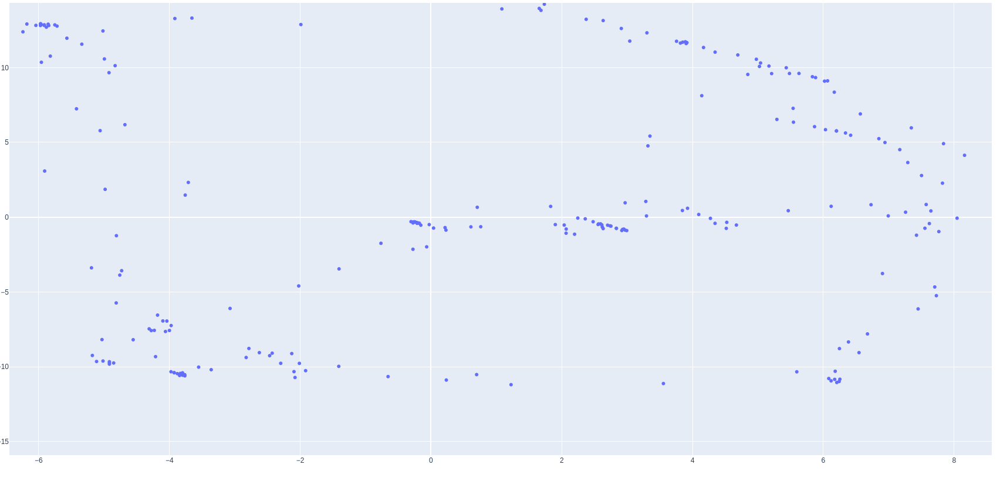

https://github.com/zhengthomastang/Cal_PnP bu repoda bazi seyleri degistirdim o yuzden ekledim repoyu oldugu gibi ekledim, nokta secme islemini bu adamin yaptigi seyi kullanarak yapiyoruz, devaminda opencv icinde homography matrix bulup world coordinate ye ceviriyor. Adamin kodunda homography matrix yanlis geliyordu o yuzden kullanamadim sadece point secmek icin kullaniliyor, kendi bilgisayarimda calisacak sekilde yaptim o yuzden pathlerde sorun cikabilir, ayrica https://github.com/zhengthomastang/Cal_PnP calistirmak icin opencv2 kurulmasi gerekiyor biraz uzun surmustu bende.

------------------------------------------

bizim salondaki hali uzerinde test ettim 2 farkli yere koydum kamerayi ikisindede benzer sonuc verdi, (resimdeki ornekte kamera 7,15 noktasinda) salon biraz kucuk oldugu icin kameraya yakin oldugum yerlerde sonuc yanlis gozukuyor ama kamerdan uzak bir yere gecince ve halinin ortasinda bekleyince sonuc iyi gozukuyor (biraz noise var gibi ama daha buyuk bir yerde yapinca accuracy artar diye tahmin ediyorum).

Su anda tek sorunumuz baska birisi de ayni ortamda bulunursa ikisini birbirine karistiriyor bu sorunu henuz cozemedim.  
